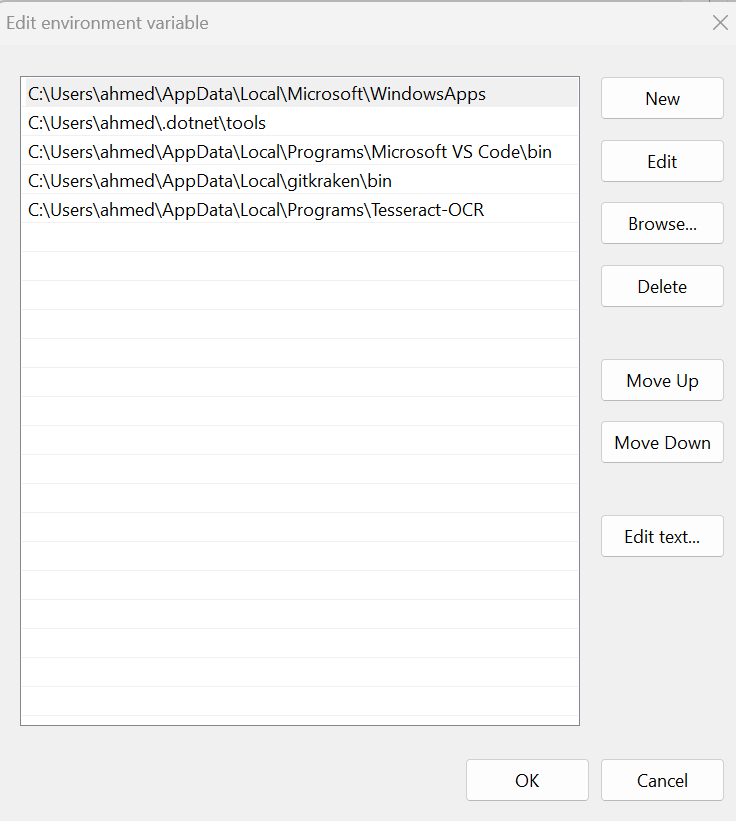
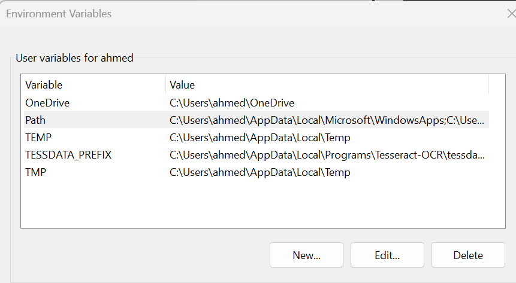
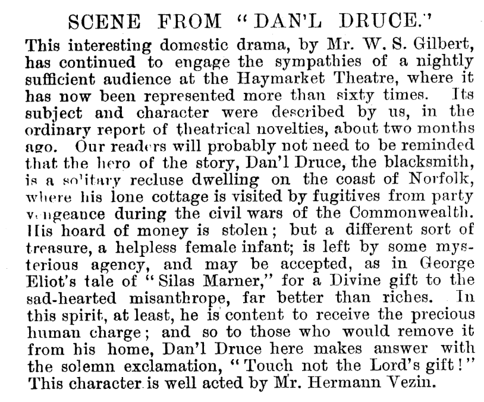
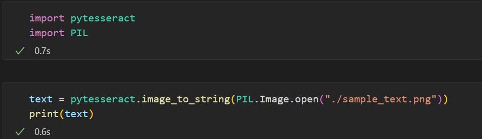
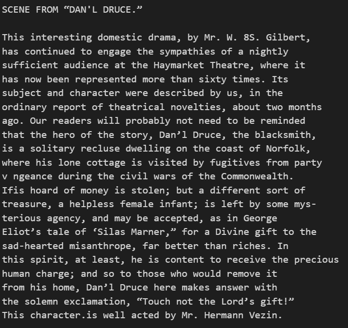
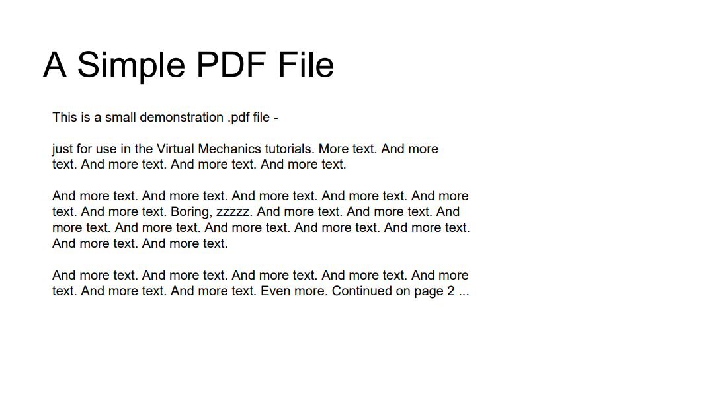
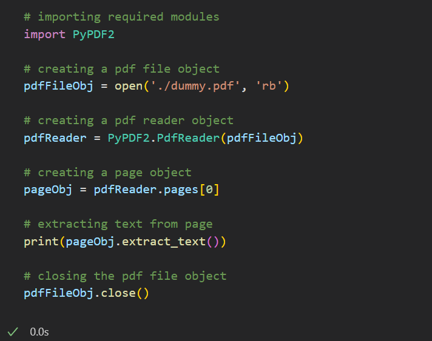
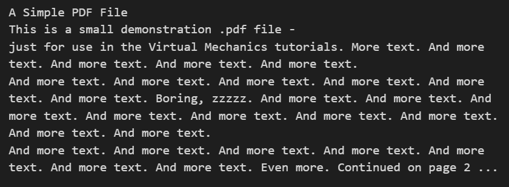

## **Abstract:**

This project aims towards creating an optical character recognition system to be

used within the organization. The primary objective is to create a backend system

that identifies text within pdf and image files.

##**Requirement Specification:**

### **Hardware Requirements:**

**Hardware Component, Requirement**

- RAM, 4GB.

- Storage/Hard Disk/SSD, 100 GB.

- Processor, Intel core i5

### **Software Requirements (libraries & dependencies):**

• Python IDLE (development environment) 3.9 or above.

• PyPDF2 library (Python module that allows you to work with PDF file).

• tesseract-ocr engine version 5.3.1.2 (open-source OCR engine developed by Google. It

is designed to recognize text in images).

• pytesseract library (allows you to easily integrate Tesseract OCR functionality into your

Python applications).

• Pillow library (fast access to data stored in a few basic pixel formats)

## **Approach:**

### **Installation:**

Assuming we have a python IDLE present, we begin with the installation of the

tesseract-ocr engine by downloading the executable file for windows. After

installation process is complete, we are required to add the path of the tesseract

engine to the environment variables as shown in image below.

Additionally, we also add a new variable in the user variable with title of

TESSDATA_PREFIX and add path to the folder titled tessdata within the

Tesseract-OCR folder as its value as shown below.

We also install the python libraries required using package installer python (pip).

### **Detecting text in PDF file:**

• Firstly, we import the required library which is PyPDF2.

• Create a pdf file object.

• Create a pdf reader object.

• Create a page object.

• Specify page number (first page starting with 0) and extract text.

• Print or perform other operations with the extracted text.

###**Detecting text in an image:**

• Import Required libraries which are pytesseract and pillow.

• Create an image object using pillow library.

• Pass the object to the image_to_string function in pytesseract.

• Print or perform other operations with extracted text.

## **Results:**

### **Detecting text in image:**

Input:      

Code snippet:  

Result:  

### **Detecting text in PDF file:**

Input:     

Code Sinppet:    

  
Result:      

##**Conclusion:**

The project demonstrates a proof of concept for development of a system that can

extract text from pdf documents and image files.
